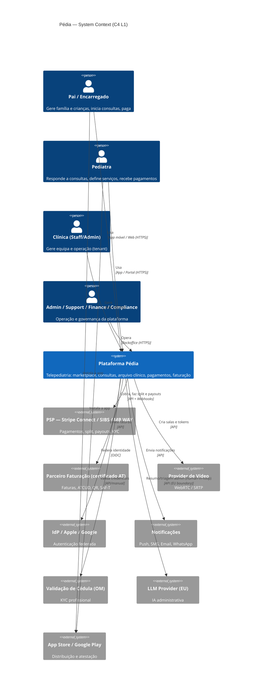

# 00 · Overview & C4 Level 1 — System Context

## Propósito do sistema
Plataforma de telepediatria privada que transforma interações informais pais↔pediatra em consultas seguras, organizadas, remuneradas e compliant — com marketplace de pediatras verificados, arquivo clínico familiar, pagamentos com split e faturação certificada.

## Atores e sistemas externos

| Ator / Sistema | Tipo | Papel |
|---|---|---|
| **Pai / Encarregado** | Pessoa | Gere família/crianças, inicia consultas, paga |
| **Pediatra** | Pessoa | Responde, define serviços/preços, recebe pagamentos |
| **Staff/Admin de Clínica** | Pessoa | Gere equipa e operação da clínica (tenant) |
| **Platform Admin / Support / Finance / Compliance** | Pessoa | Operação, validação, finanças, RGPD |
| **PSP (Stripe Connect / SIBS / MB WAY)** | Sistema externo | Pagamentos, split, payouts, KYC |
| **Parceiro de Faturação (certificado AT)** | Sistema externo | Faturas, ATCUD, QR, SAF-T |
| **Provider de Vídeo (LiveKit/Twilio)** | Sistema externo | WebRTC media |
| **IdP / Social (Apple, Google)** | Sistema externo | Autenticação federada |
| **Notificações (FCM/APNs, SMS, Email, WhatsApp)** | Sistema externo | Mensagens |
| **Validação de Cédula (Ordem dos Médicos)** | Sistema externo | KYC profissional |
| **LLM Provider (EU boundary)** | Sistema externo | IA administrativa |
| **App/Play Stores** | Sistema externo | Distribuição |
| **SNS 24 / Urgência** | Externo (encaminhamento) | Segurança clínica (não integração de dados) |

## C4 — Nível 1: System Context

## Fronteiras de confiança (resumo — detalhe no [doc 09](09-security-architecture.md))
- **Untrusted**: apps/clientes, conteúdo de utilizador e ficheiros, internet pública.
- **Edge trust**: CDN/WAF/DDoS, API Gateway (termina TLS, autentica/autoriza).
- **Trusted (Zero Trust interno)**: serviços com mTLS; **nada é confiável por estar "na rede"**.
- **Dados clínico-sensíveis**: zona de máxima proteção (encriptação a nível de campo, RLS, acesso auditado).

## Decisões de nível 1 (ADR sumário)
| ADR | Decisão | Porquê |
|---|---|---|
| ADR-001 | Modular monolith → serviços | Velocidade de MVP + caminho de escala sem reescrita |
| ADR-002 | Buy compliance-pesado (faturação/vídeo/KYC) | Certificação morosa; foco no core diferenciador |
| ADR-003 | Cloud UE + data residency | RGPD/EHDS, dados de saúde de menores |
| ADR-004 | Abstração de PSP | Mitigar risco de fornecedor; combinar Stripe + SIBS |
| ADR-005 | IA só administrativa, human-in-the-loop | Evitar classificação como dispositivo médico (MDR) |
