# 01 · System Architecture — C4 Level 2 (Container)

Visão de containers (aplicações/serviços executáveis e datastores) da plataforma.

## C4 — Nível 2: Container

```mermaid
C4Container
    title Pédia — Container Diagram (C4 L2)

    Person(parent, "Pai", "App móvel")
    Person(pediatrician, "Pediatra", "App / Portal")
    Person(internal, "Admin/Support/Finance/Compliance", "Backoffice")

    System_Boundary(pedia, "Plataforma Pédia") {
        Container(mobile, "Mobile App", "Flutter (iOS/Android)", "Pais e pediatras; segurança no dispositivo")
        Container(webmkt, "Web Marketplace & Portal", "Next.js/React", "Marketplace SEO, portal do pediatra, web dos pais")
        Container(backoffice, "Backoffice", "Next.js/React", "Admin/Support/Finance/Compliance")

        Container(edge, "Edge / CDN / WAF / DDoS", "CloudFront/Cloudflare", "TLS, bot, geo, rate limit")
        Container(gw, "API Gateway / BFF", "Kong/APIGW + NestJS BFF", "AuthN/Z, schema validation, throttling")

        Container(core, "Core API (Modular Monolith)", "NestJS/TypeScript", "Domínios: identity, family, clinical, consultations, marketplace, payments, invoicing, admin")
        Container(rt, "Realtime Gateway", "NestJS + WebSocket", "Chat, presença, estados de consulta")
        Container(worker, "Async Workers", "NestJS/BullMQ", "Faturação, payouts, notificações, scans, IA")
        Container(aisvc, "AI Service", "Python/TS + LLM gateway", "Resumo/triagem admin, DLP, audit")

        ContainerDb(pg, "PostgreSQL", "Relacional", "Dados estruturados, RLS, particionado")
        ContainerDb(redis, "Redis", "Cache/Filas/PubSub", "Sessões, presença, rate limit")
        ContainerDb(search, "OpenSearch", "Busca", "Marketplace, pesquisa clínica")
        ContainerDb(objstore, "Object Storage", "S3-compatível (SSE-KMS)", "Ficheiros clínicos encriptados")
        ContainerDb(bus, "Event Bus", "Kafka/SNS+SQS", "Eventos de domínio")
        ContainerDb(audit, "Audit Store", "Append-only (WORM)", "Logs imutáveis de acesso clínico")
    }

    System_Ext(psp, "PSP (Stripe/SIBS)")
    System_Ext(billing, "Faturação certificada AT")
    System_Ext(video, "Vídeo (LiveKit/Twilio)")
    System_Ext(idp, "IdP (Apple/Google/Keycloak)")
    System_Ext(notify, "Notificações (FCM/APNs/SMS/Email)")
    System_Ext(llm, "LLM (EU)")

    Rel(parent, mobile, "Usa", "HTTPS/WSS")
    Rel(pediatrician, mobile, "Usa", "HTTPS/WSS")
    Rel(pediatrician, webmkt, "Usa", "HTTPS")
    Rel(internal, backoffice, "Usa", "HTTPS + MFA")

    Rel(mobile, edge, "API", "HTTPS")
    Rel(webmkt, edge, "API", "HTTPS")
    Rel(backoffice, edge, "API", "HTTPS")
    Rel(edge, gw, "Encaminha", "HTTPS")
    Rel(gw, core, "Invoca", "mTLS")
    Rel(gw, rt, "WebSocket", "WSS/mTLS")
    Rel(gw, idp, "Autentica", "OIDC")

    Rel(core, pg, "Lê/escreve", "TLS")
    Rel(core, redis, "Cache/filas", "TLS")
    Rel(core, search, "Indexa/consulta", "TLS")
    Rel(core, objstore, "Signed URLs", "TLS")
    Rel(core, bus, "Publica eventos", "TLS")
    Rel(rt, redis, "Presença/pubsub", "TLS")
    Rel(bus, worker, "Consome", "TLS")
    Rel(worker, billing, "Emite faturas", "API")
    Rel(worker, psp, "Split/payouts", "API")
    Rel(worker, notify, "Envia", "API")
    Rel(worker, aisvc, "Pede resumo", "mTLS")
    Rel(aisvc, llm, "Inferência", "TLS (EU)")
    Rel(aisvc, audit, "Regista", "append-only")
    Rel(core, audit, "Regista acessos clínicos", "append-only")
    Rel(core, video, "Salas/tokens", "API")
```

## Containers — responsabilidades

| Container | Responsabilidade | Notas de arquitetura |
|---|---|---|
| **Mobile App (Flutter)** | UX pais + pediatras | RASP, cert pinning, secure storage, Play Integrity/App Attest |
| **Web Marketplace & Portal** | SEO do marketplace, portal pediatra, web dos pais | SSR/ISR para SEO; mesmo design system |
| **Backoffice** | Operação interna | Atrás de SSO+MFA, rede restrita, RBAC fino |
| **Edge/CDN/WAF** | Primeira linha de defesa | TLS 1.3, DDoS, bot, geo, rate limit |
| **API Gateway / BFF** | Ponto único de entrada | OIDC, validação OpenAPI, quotas; BFF agrega para mobile/web |
| **Core API (modular monolith)** | Lógica de domínio | Módulos com fronteiras explícitas; preparado para extração |
| **Realtime Gateway** | Chat e estados em tempo real | WebSocket stateless + Redis pub/sub |
| **Async Workers** | Trabalho assíncrono | Idempotência, retries, DLQ; faturação/payouts/IA/scan |
| **AI Service** | IA administrativa segura | Isolamento por tenant, DLP, prompt-injection guard, audit |
| **PostgreSQL** | Verdade transacional | RLS, particionamento, encriptação de campo |
| **Object Storage** | Ficheiros clínicos | SSE-KMS, signed URLs curtos, scan prévio |
| **Event Bus** | Desacoplamento e escala | Eventos de domínio (`consultation.closed`, `payment.captured`…) |
| **Audit Store** | Trilho imutável | WORM/append-only, retenção longa |

## Domínios (bounded contexts) dentro do Core
`identity` · `family & children` · `clinical-records` · `consultations & messaging` · `scheduling` · `marketplace & reviews` · `payments` · `invoicing` · `notifications` · `admin & audit` · `ai-assist`.

Cada domínio tem o seu esquema lógico, eventos e API interna — o que permite **extrair para serviço autónomo** os de maior volume (messaging, files, video-signaling, notifications) sem refatorar consumidores (comunicação por eventos/contratos estáveis).

## Estilo arquitetural
- **Hexagonal / Ports & Adapters** dentro de cada domínio (isola fornecedores externos: PSP, faturação, vídeo, LLM → adaptadores substituíveis).
- **CQRS leve** onde compensar (leituras de marketplace via OpenSearch; escritas via Postgres).
- **Saga/orquestração** para fluxos distribuídos (consulta→pagamento→fatura→payout) com compensação (reembolsos/notas de crédito).
