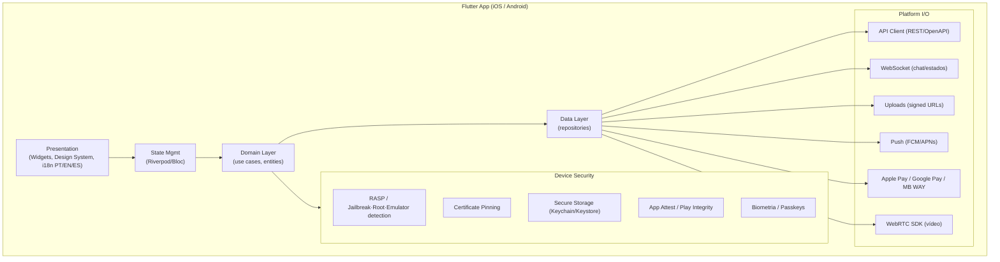
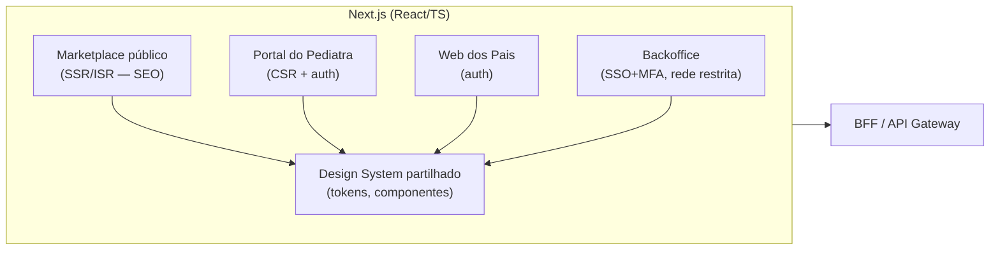
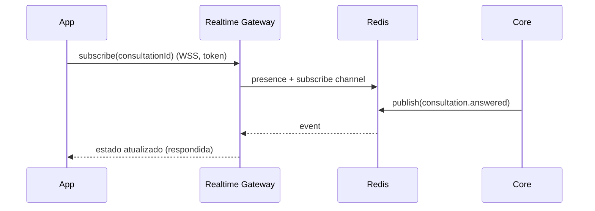

# 02 · Frontend Architecture

*(Principal Mobile Architect + CPO)*

Dois clientes principais: **App móvel (Flutter)** para pais e pediatras, e **Web (Next.js)** para marketplace público (SEO), portal do pediatra, web dos pais e backoffice.

## Visão de componentes — App móvel (Flutter)

### Decisões mobile
- **Flutter** (justificação no [doc 13](13-technology-stack.md)): único codebase iOS/Android, UI premium consistente, performance nativa.
- **Clean Architecture** (presentation → domain → data) para testabilidade e troca de fornecedores.
- **State management**: **Riverpod** (ou Bloc) — previsível, testável, compile-safe.
- **Offline-first leve**: cache local encriptada (apenas dados não-sensíveis ou cifrados); sincronização ao reconectar; **dados clínicos não persistem em claro** no dispositivo.
- **Segurança no dispositivo** (ver [E05 enterprise](../enterprise/05-app-api-file-video-security.md)): RASP, cert pinning, secure storage, atestação verificada **no servidor**, bloqueio de screenshots em ecrãs clínicos, ocultação no app switcher.
- **Feature flags + forced update** (remote config) para kill-switch de versões inseguras.
- **Acessibilidade** (WCAG 2.2 AA), **i18n** desde o início.

## Visão de componentes — Web (Next.js)

### Decisões web
- **Next.js**: **SSR/ISR** para SEO do marketplace (descoberta orgânica de pediatras), **CSR** para áreas autenticadas.
- **Backoffice** separado logicamente, atrás de **SSO + MFA** e rede restrita (não exposto na mesma superfície pública).
- **Design system partilhado** (tokens) entre web e — via paridade visual — a app, para consistência de marca premium.

## Padrão BFF (Backend-for-Frontend)
- Um **BFF** por tipo de cliente (mobile, web, backoffice) agrega chamadas, adapta payloads e reduz round-trips em mobile — sem espalhar lógica de domínio no cliente.
- O BFF **não contém regras de negócio** de domínio; orquestra e adapta.

## Gestão de estado de consulta em tempo real

## Performance & UX (CPO)
- Orçamentos de performance (cold start, p95 de ecrãs-chave), lazy loading, imagens otimizadas.
- Tom **seguro, humano, clínico, tranquilizador** ([doc 19 UX](../docs/19-ux-ui-wireframes.md)).
- Telemetria de produto **pseudonimizada** (nunca dados clínicos em analytics sem base legal).
