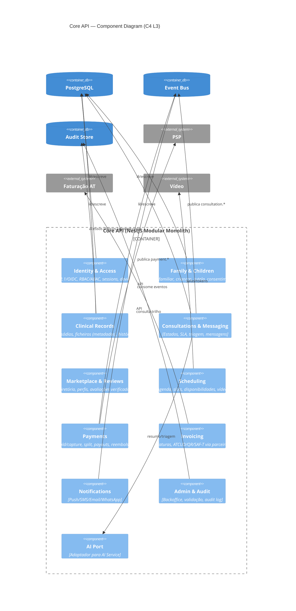
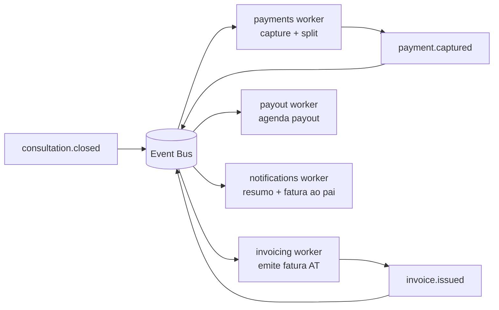

# 03 · Backend Architecture — C4 Level 3 (Component)

*(Principal Solution Architect + CTO)*

O backend é um **modular monolith** em **NestJS/TypeScript**, organizado por **bounded contexts**, com fronteiras explícitas e comunicação interna por chamadas diretas (in-process) ou eventos. Domínios de alto volume são extraíveis para serviços sem alterar consumidores.

## C4 — Nível 3: Component (Core API)

## Padrões internos
- **Hexagonal (Ports & Adapters)**: cada integração externa (PSP, faturação, vídeo, LLM, notificações) é um **adapter** atrás de uma **port** → substituível e testável (mitiga lock-in; suporta multi-PSP/multi-país).
- **Domain events + Outbox pattern**: escrita transacional na DB + evento publicado de forma fiável (sem perder eventos) → consistência entre `payment.captured` → `invoice.requested` → `payout.scheduled`.
- **Saga (orquestrada)** para o fluxo consulta→pagamento→fatura→payout, com **compensação** (refund/credit note).
- **CQRS leve**: leituras de marketplace servidas por **OpenSearch** (projeções), escritas por Postgres.
- **Idempotência** em todos os handlers de pagamento/faturação/notificação (idempotency keys).

## Fluxo de eventos de domínio (exemplo)

## Contratos e versionamento de API
- **OpenAPI** como fonte de verdade; geração de SDKs tipados (cliente Flutter/Web).
- Versionamento semântico de API; *deprecation policy*; compatibilidade retroativa.
- Validação de schema no **API Gateway** e no serviço (defesa em profundidade).

## Tempo real (Realtime Gateway)
- Serviço **stateless** de WebSocket; **Redis pub/sub** para fan-out e presença; autenticação por token curto; autorização por pertença à consulta.
- Persistência de mensagens **assíncrona** (não bloqueia o caminho de entrega).

## Resiliência
- **Timeouts, retries com backoff, circuit breakers** em todas as integrações externas.
- **Dead-letter queues** + reprocessamento; **bulkheads** por integração (uma falha do PSP não derruba a faturação).
- Health checks, readiness/liveness, graceful shutdown.

## Multi-tenant & isolamento
- `tenant_id`/`family_id` propagados no contexto de pedido (Zero Trust); **RLS** no Postgres + verificação na aplicação.
- Isolamento de dados clínicos por criança/família imposto em **todas** as queries (guard + policy).

## Quando extrair serviços (gatilhos de escala)
| Domínio | Gatilho de extração |
|---|---|
| Messaging/Realtime | Conexões WS e throughput de mensagens |
| Files | Volume de uploads/scan e storage |
| Video signaling | Sessões simultâneas |
| Notifications | Volume de envios e fan-out |
| AI Service | Já isolado desde o início (segurança) |
