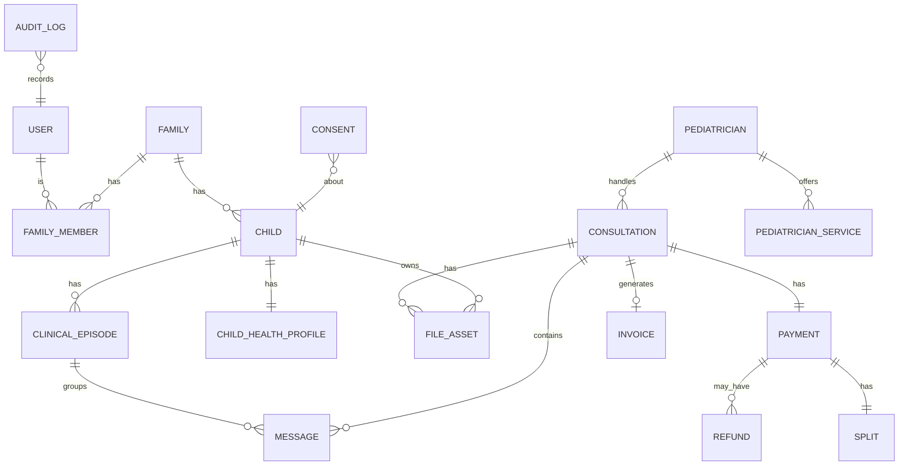
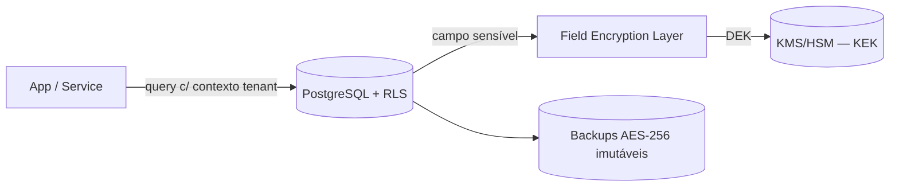

# 04 · Database Architecture

*(Principal Solution Architect + Cybersecurity Architect + Compliance Officer)*

## Poliglота de persistência (cada dado no seu store)

| Store | Tecnologia | Uso |
|---|---|---|
| **Relacional** | **PostgreSQL** | Verdade transacional: contas, famílias, crianças, consultas, pagamentos, faturas |
| **Cache/Filas** | **Redis** | Sessões, presença de chat, rate limit, filas leves |
| **Busca** | **OpenSearch** | Marketplace, pesquisa de histórico (projeções) |
| **Objetos** | **S3-compatível (SSE-KMS)** | Ficheiros clínicos (imagens, vídeos, PDFs) |
| **Eventos** | **Kafka / SNS+SQS** | Eventos de domínio (event sourcing leve onde útil) |
| **Audit** | **Append-only / WORM** | Trilho imutável de acessos clínicos |

## Modelo lógico (ver [modelo de dados do blueprint](../docs/10-modelo-dados.md) para o esquema completo)

## Encriptação (Defense in Depth de dados)
- **At rest**: AES-256 em DB, storage, backups (transparente).
- **Field-level encryption** para dados clínico-sensíveis (`child_health_profile`, conteúdos clínicos): **envelope encryption** (DEK por registo/tenant, KEK no KMS) — a DB cifrada **não basta**.
- **Crypto-shredding**: apagamento RGPD por destruição de chave quando a remoção física imediata é inviável.
- **Row-Level Security (RLS)**: políticas por `family_id`/`tenant_id` — o acesso é negado por defeito ao nível do motor (Secure by Default).

## Particionamento e sharding (caminho de escala — ver [doc 12](12-scalability-architecture.md))
- **Particionamento** de tabelas grandes:
  - `message`, `audit_log`, `consultation` → partição por **tempo** (e/ou tenant).
  - `file_asset` (metadados) → partição por tempo; binários no object storage.
- **Sharding horizontal** por `country`/`tenant` quando uma instância saturar — a **chave de sharding já existe** no modelo (`country_id`, `tenant_id`).
- **Read replicas** para leitura; **PgBouncer** para pooling; escalas de leitura sem tocar nas escritas.
- **100M+ documentos clínicos**: metadados indexados em Postgres particionado; **binários em object storage** (escala ~ilimitada + tiering para frio).

## Integridade e imutabilidade (Compliance)
- **Imutáveis**: `message`, `invoice`, `consent`, `audit_log` (append-only). Correções via novos registos/notas de crédito.
- **Outbox table** para publicação fiável de eventos (atomicidade escrita+evento).
- **Constraints/foreign keys** garantem segregação família↔criança a nível de dados.

## Retenção e ciclo de vida (Compliance Officer)
| Categoria | Política |
|---|---|
| Clínico | Conforme normas de saúde (a confirmar com Ordem/legal) |
| Fiscal (faturas) | Retenção legal PT (tipicamente ~10 anos — confirmar) |
| Audit log | Retenção longa (evidência) |
| Operacional/analytics | Mínimo, pseudonimizado |
| Apagamento RGPD | Crypto-shredding + conciliação com retenção legal |

## Backups & recuperação (ver [doc 10](10-deployment-architecture.md) e [E08](../enterprise/08-secops-bcdr.md))
- **PITR** (WAL archiving) → **RPO < 15 min**.
- Backups diários/semanais/mensais (GFS), **imutáveis (object lock)**, **cross-region UE**, encriptados.
- **Restore drills** regulares; verificação de integridade e de desencriptação.

## Justificação PostgreSQL (resumo — detalhe no [doc 13](13-technology-stack.md))
- ACID forte (essencial em pagamentos/faturação), **RLS nativo** (segurança multi-tenant), particionamento, extensões (pgcrypto, PostGIS futuro), maturidade open-source, custo, talento abundante, e ofertas geridas UE.
