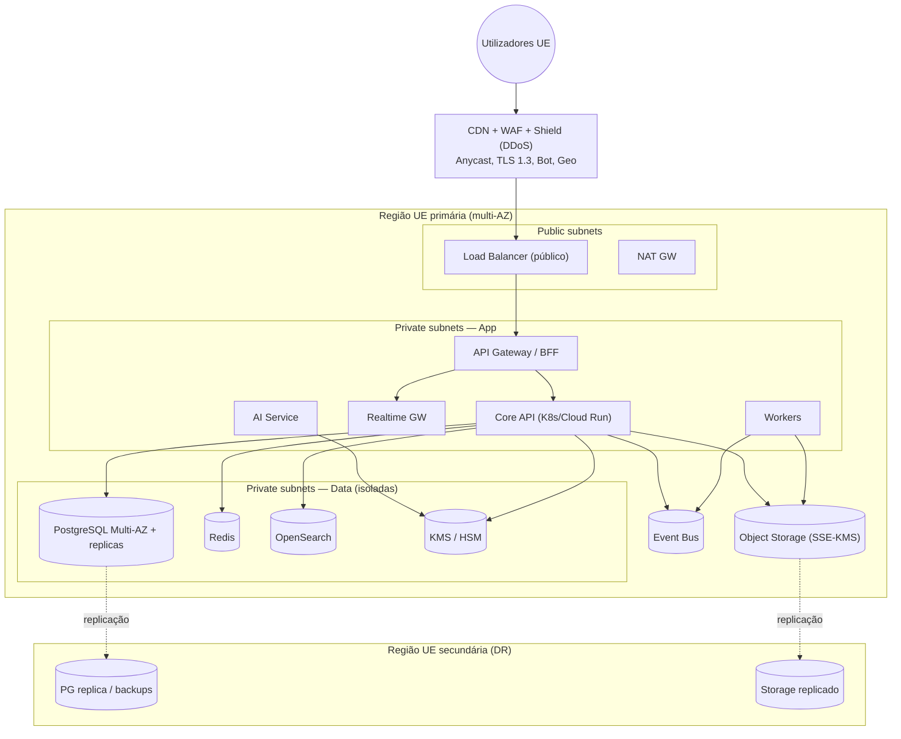

# 05 · Cloud Architecture

*(CTO + Principal Solution Architect + Cybersecurity Architect)*

## Escolha de cloud
**AWS (regiões UE: `eu-west-1` Irlanda + `eu-west-3` Paris)** como primária, ou **GCP europe-west** como alternativa equivalente. Critérios: **residência de dados UE**, breadth de serviços geridos (KMS/HSM, RDS, EKS, WAF/Shield), maturidade de compliance (ISO/SOC2/HDS na UE), e talento. Para soberania reforçada, **OVHcloud/Scaleway** consideráveis para cargas específicas. *Toda a arquitetura é IaC (Terraform) → portável.*

## Topologia de rede (multi-AZ, multi-região UE)

## Princípios de rede (Zero Trust)
- **Subnets privadas** para app e dados; **bases de dados sem rota para a internet**; egresso via NAT controlado.
- **Security groups default-deny**; segmentação app↔data; **mTLS** entre serviços.
- **VPC endpoints / PrivateLink** para serviços geridos (sem sair para a internet pública).
- **WAF + Shield/DDoS** no edge; **bastion/SSM** (sem SSH direto) para administração; acesso JIT.
- **Secrets Manager/Vault** + **KMS/HSM**; rotação automática.

## Serviços geridos (buy onde não diferencia)
| Necessidade | Serviço gerido (AWS) | Porquê gerido |
|---|---|---|
| Postgres | **RDS/Aurora PostgreSQL** | HA, backups, PITR, patching |
| Cache | **ElastiCache (Redis)** | Operação simplificada |
| Busca | **OpenSearch Service** | Escala de indexação |
| Filas/eventos | **SNS+SQS / MSK (Kafka)** | Desacoplamento gerido |
| Objetos | **S3 + Object Lock** | Durabilidade, imutabilidade, tiering |
| Chaves | **KMS / CloudHSM** | FIPS, rotação, auditoria |
| Compute | **EKS** (ou **Fargate/Cloud Run** no início) | Escala; começar serverless-containers |
| Edge | **CloudFront + WAF + Shield** | DDoS/bot/cache |
| Observability | **CloudWatch + OTel + Grafana** | Telemetria |

## Multi-região e residência de dados
- **Dados clínicos permanecem na UE.** DR numa **segunda região UE**.
- **Data residency por país** preparada para expansão (ES/UE): possibilidade de isolar dados por jurisdição (sharding/região por país).
- Replicação assíncrona cross-region UE para **RPO<15m / RTO<1h** ([doc 10](10-deployment-architecture.md)).

## FinOps (CTO)
- Autoscaling (HPA), **spot/reserved** para batch, **tiering S3** (frio para ficheiros antigos), budgets e alertas, observabilidade de **custo por tenant/país**.
- Começar com **Fargate/Cloud Run** (menor overhead) → migrar para EKS quando a densidade/escala compensar.

## Justificação (resumo)
- **Cloud UE gerida**: maximiza velocidade e compliance (RGPD/EHDS) com mínimo de operação; evita reinventar HA/backup/segurança.
- **IaC (Terraform)**: reprodutibilidade, revisão, *policy as code*, portabilidade entre clouds.
- **Multi-AZ desde o início, multi-região para DR**: resiliência sem complexidade prematura de active-active.
