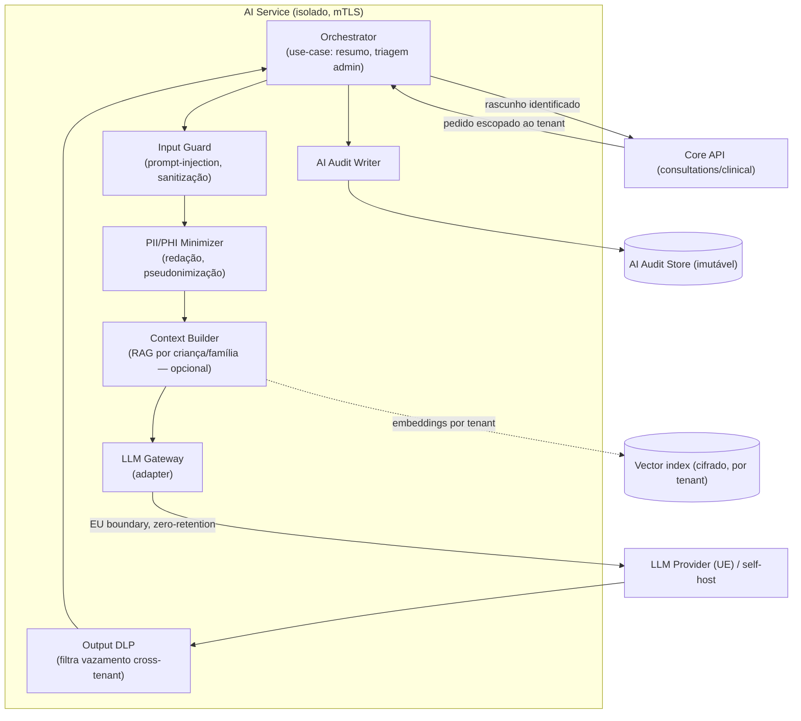
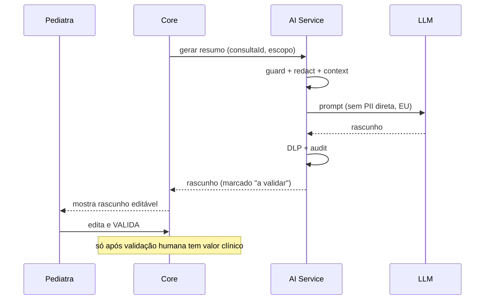

# 06 · AI Architecture

*(CTO + Cybersecurity Architect + Compliance Officer)*

A IA é **assistente administrativa** (resumo, organização, triagem administrativa) — **nunca** diagnóstico autónomo. Isolada num **AI Service** dedicado com controlos de segurança próprios (ver [E06 enterprise](../enterprise/06-ai-security.md)).

## Component diagram — AI Service

## Controlos de segurança (mapeados ao requisito)
| Requisito | Mecanismo |
|---|---|
| **A IA nunca diagnostica** | Casos de uso limitados; saída sempre **rascunho** com validação humana obrigatória (human-in-the-loop) |
| **Não expor dados entre utilizadores** | Contexto estritamente escopado ao tenant/consulta; verificação de pertença antes de construir contexto |
| **Não expor dados entre pediatras** | Isolamento por tenant; índices/embeddings segregados e cifrados por tenant |
| **Não treinar com dados clínicos sem consentimento** | LLM com **zero data retention** + **opt-out de treino** contratual; consentimento específico; preferir self-host para dados sensíveis |
| **Tenant Isolation** | Mesmas fronteiras RBAC/ABAC/RLS do core; sem memória partilhada entre tenants |
| **Prompt Injection Protection** | Input Guard: conteúdo do utilizador tratado como dados, nunca instruções; allow-list de ações; a IA **não tem permissões diretas** |
| **Data Leakage Prevention** | Minimizador PII/PHI à entrada + DLP à saída; redação antes de enviar ao modelo |
| **AI Audit Logs** | Registo imutável (input ref/hash, versão de prompt/modelo, output, validador humano, timestamp) |

## Padrão de execução (human-in-the-loop)

## Governança de IA (Compliance)
- **AI Act (UE)**: casos de uso classificados; manter **fora** de uso clínico autónomo reduz exposição; documentar gestão de risco, transparência, supervisão humana, robustez.
- **Transparência ao utilizador** e consentimento para processamento por IA.
- **Versionamento** de prompts/modelos; avaliação de qualidade e viés; **red-teaming** (prompt injection/jailbreak) no ciclo de segurança.
- **Kill-switch** por feature flag.

## Stack de IA (justificação no [doc 13](13-technology-stack.md))
- **LLM Gateway (adapter)** para trocar de fornecedor/modelo sem reescrever (Ports & Adapters).
- Preferência por modelos com **EU data boundary / enterprise privacy** ou **self-host** (vLLM) para dados clínicos.
- **Vector index** (pgvector/OpenSearch) **cifrado e segregado por tenant** se houver RAG.
