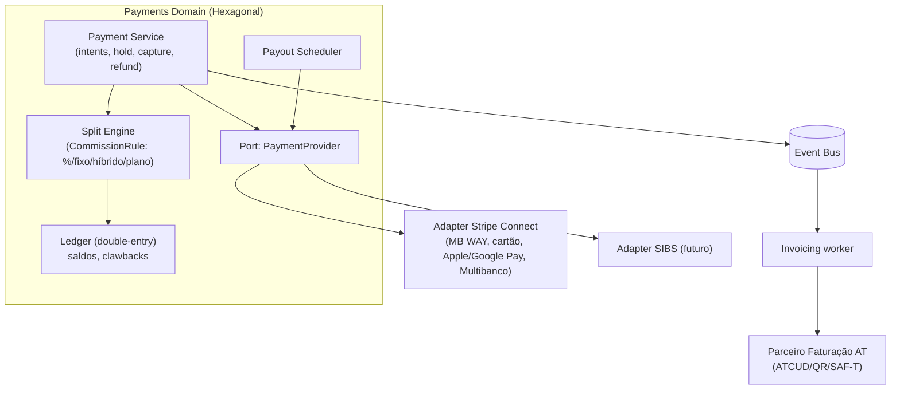
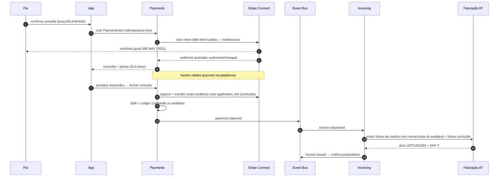
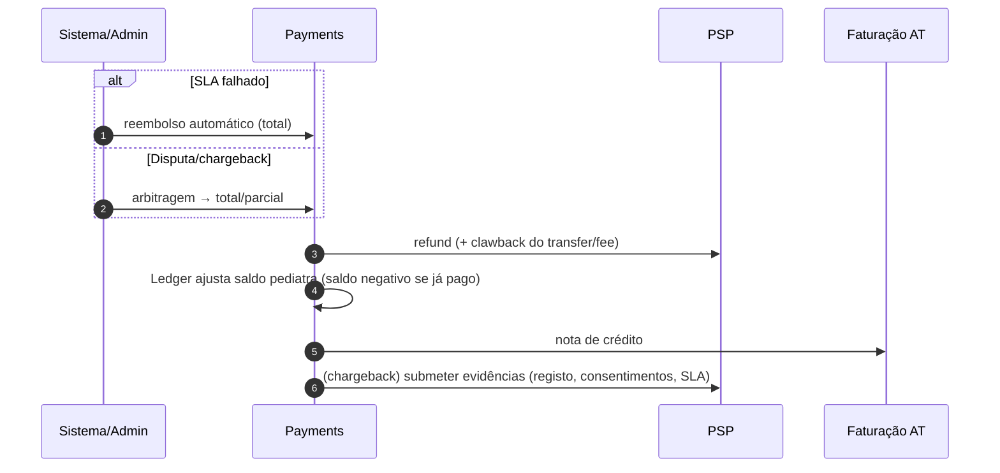

# 07 · Payments Architecture

*(CTO + Principal Solution Architect + Compliance Officer)*

Pagamentos com **pré-pagamento/escrow → split no fecho → payout**, abstraídos por uma **port `PaymentProvider`** (Stripe Connect primário, SIBS adicionável). Faturação certificada AT acoplada por evento. Ver [fluxos do blueprint](../docs/11-fluxos-pagamento.md) e [faturação](../docs/12-faturacao-portugal.md).

## Componentes

## Data Flow Diagram — Consulta paga (pré-pago → captura → split → fatura)

## Data Flow Diagram — Reembolso / SLA falhado / disputa

## Modelo de fundos (escrow-like)
- **Cartão**: auth hold → capture no fecho.
- **MB WAY/Multibanco**: cobrança imediata → **retenção na conta da plataforma (escrow)** → libertação/transfer no fecho; **reembolso** se SLA falhar.
- **Separate charges & transfers** (Stripe): plataforma recebe, depois transfere ao pediatra retendo `application_fee` (comissão).
- ⚠️ Enquadramento de **escrow/serviços de pagamento** a validar (PSP como agente regulado; plataforma não presta serviços de pagamento por si) — ver [doc 18](../docs/18-perguntas-criticas.md).

## Split & comissões (configurável)
- `CommissionRule` por **pediatra / país / tipo de consulta / plano** → **%, fee fixo, híbrido, plano mensal, destaque**.
- **Ledger double-entry** garante rastreabilidade (GMV, comissão, líquido do pediatra, reembolsos, clawbacks) — fonte para dashboard financeiro e reconciliação.

## Faturação compliant (separação clara)
- **Doc 1**: ato médico → paciente (emitido **em nome e por conta do pediatra**; provável **isenção de IVA** — a validar).
- **Doc 2**: comissão → pediatra (IVA 23% — a validar).
- **Multi-emitente** (cada pediatra é emitente fiscal); ATCUD/QR/SAF-T/e-Fatura via parceiro certificado.
- Camada `TaxRule`/`Country` **plugável por país** para expansão.

## Segurança de pagamentos
- **PCI-DSS SAQ A** (tokenização do PSP; nunca tocar PAN).
- **SCA/3-D Secure** (PSD2); **webhooks assinados e verificados**; **idempotência**; **reconciliação diária**; **rolling reserve** para chargebacks (a negociar com PSP).

## Justificação (resumo — detalhe no [doc 13](13-technology-stack.md))
- **Stripe Connect primeiro**: split + KYC de pediatras + cobertura de métodos + DX → velocidade de MVP.
- **Abstração `PaymentProvider`**: adicionar **SIBS** para MB WAY a custo otimizado quando o volume justificar, sem reescrever o domínio.
- **Ledger próprio**: nunca depender só do PSP para a verdade financeira (auditoria, multi-PSP, multi-país).
