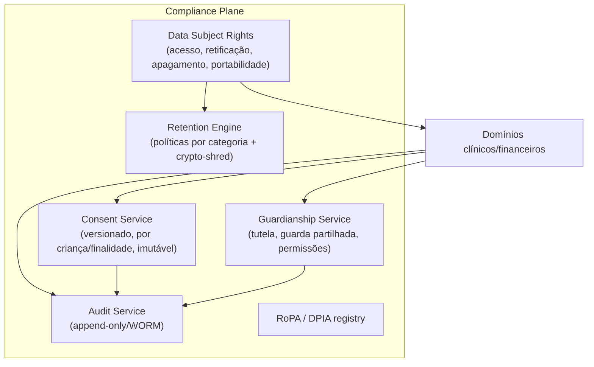
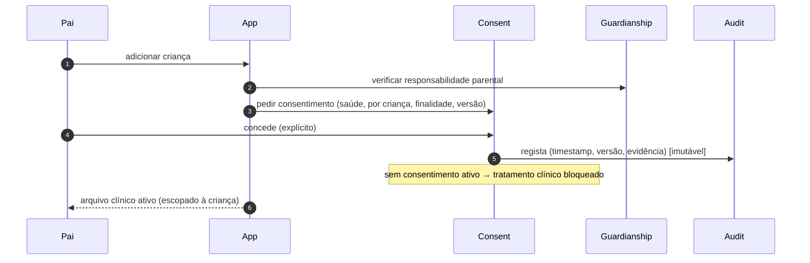
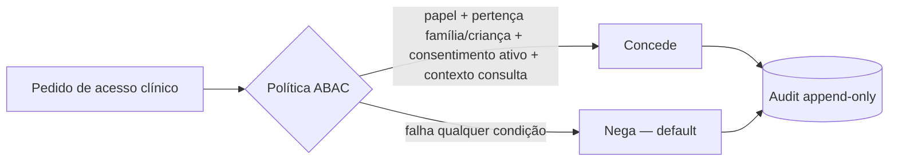

# 08 · Healthcare Compliance Architecture

*(Healthcare Compliance Officer + Cybersecurity Architect)*

Arquitetura que materializa RGPD (categoria especial + menores), enquadramento PT (ERS/Ordem/AT) e preparação UE (EHDS/NIS2/DORA/ePrivacy). Ver [E07 enterprise](../enterprise/07-compliance.md) e [riscos legais](../docs/13-riscos-legais.md).

## Componentes de compliance

## Fluxo de consentimento (dados de saúde do menor)

## Controlo de acesso a dados clínicos (granular + auditado)

- Acesso do pediatra **só no contexto** de consulta ativa ou partilha consentida, **com expiração**.
- Partilha entre médicos: consentida, temporária, revogável.
- **Todos** os acessos a dados de menores são rastreáveis (quem/quando/o quê/contexto).

## Direitos do titular (DSR) — operacionalização
| Direito | Mecanismo |
|---|---|
| Acesso | Exportação self-service / via Compliance |
| Retificação | Edição + adenda (registo imutável preservado) |
| Apagamento | Account deletion in-app → DSR → **crypto-shredding** + conciliação retenção legal |
| Portabilidade | Exportação estruturada (preparar **FHIR** para EHDS) |
| Oposição/limitação | Flags de tratamento; revogação de consentimento |

## Mapa regulatório → controlo de arquitetura
| Regulação | Materialização |
|---|---|
| **RGPD** | Consent service, DSR, RoPA, DPIA, audit, encriptação, DPAs, dados UE |
| **Menores** | Guardianship, consentimento parental por criança, proteção reforçada |
| **ERS / Ordem (PT)** | Modelo intermediário, validação de cédula, registo clínico, regras de publicidade no marketplace |
| **AT (PT)** | Faturação certificada (ATCUD/QR/SAF-T) — [doc 07](07-payments-architecture.md) |
| **EHDS** | Interoperabilidade FHIR, portabilidade, controlo do titular |
| **NIS2** | SecOps, gestão de risco, reporte de incidentes ([E08](../enterprise/08-secops-bcdr.md)) |
| **DORA** | Resiliência operacional, gestão de terceiros críticos (via PSP/seguradoras) |
| **ePrivacy** | Consentimento de cookies/comunicações; sem tracking de saúde para ads |
| **AI Act / MDR** | IA administrativa, decisão humana → não dispositivo médico ([doc 06](06-ai-architecture.md)) |

## Residência e soberania
- Dados clínicos **na UE**; fornecedores com **DPA** + data residency UE.
- **Data residency por país** preparada (sharding/região por jurisdição) para expansão.

## Gates de compliance (não passar sem)
- **Pré-beta**: DPIA, DPO, RoPA, consentimentos, DPAs, encriptação, audit.
- **Pré-lançamento PT**: pareceres ERS/Ordem/MDR, faturação certificada, termos/políticas.
- **Pré-expansão**: validação local + EHDS readiness + NIS2/DORA assessment.

> ⚠️ Posições ERS/Ordem/AT/EHDS são **a confirmar** com assessoria especializada ([doc 18](../docs/18-perguntas-criticas.md)).
