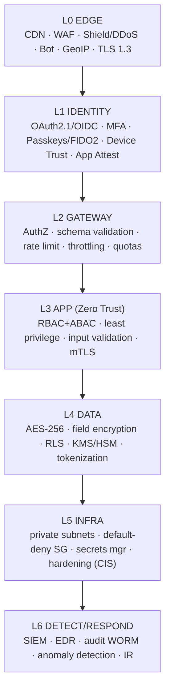
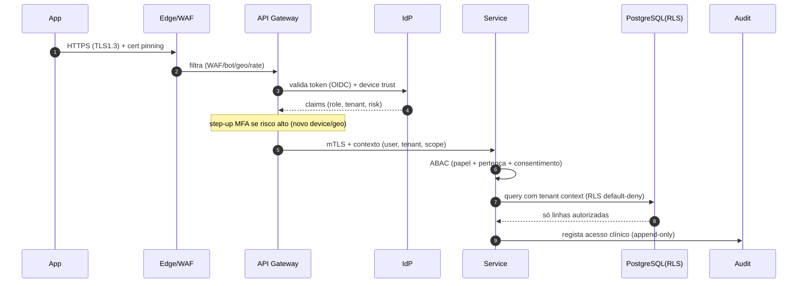
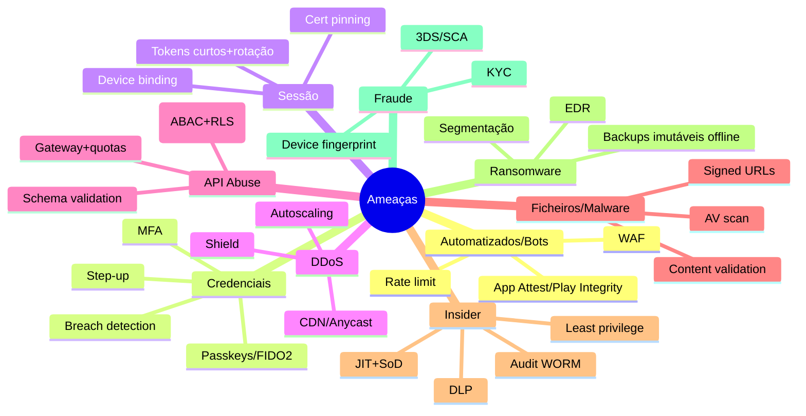

# 09 · Security Architecture

*(Cybersecurity Architect)*

Zero Trust + Defense in Depth + Secure by Default. Mapeia o [modelo de ameaças enterprise](../enterprise/02-security-architecture.md) à arquitetura concreta.

## Security diagram — camadas (Defense in Depth)

## Zero Trust — pedido autenticado/autorizado em cada salto

## Threat model → controlos (resumo; detalhe em [E02](../enterprise/02-security-architecture.md))

## IAM (ver [E03](../enterprise/03-iam-authentication.md))
- **OAuth 2.1 / OIDC**, **Passkeys/FIDO2/biometria**; **MFA obrigatório** para pediatras/clínicas/internos.
- **8 perfis** (Parent, Pediatrician, Clinic Staff, Clinic Admin, Platform Admin, Support, Finance, Compliance).
- **RBAC + ABAC** (papel + `family_id`/`tenant_id` + sensibilidade + risco da sessão); **least privilege**, **segregation of duties**, **JIT** para produção.

## Encriptação (ver [doc 04](04-database-architecture.md))
- **In transit**: TLS 1.3 externo + **mTLS** interno; cert pinning na app.
- **At rest**: AES-256 + **field-level (envelope)** para clínico-sensível; **KMS/HSM** + rotação; crypto-shredding.

## Segurança da app móvel (ver [E05](../enterprise/05-app-api-file-video-security.md))
- Jailbreak/root/emulator detection, RASP, anti-tampering, obfuscation, secure storage; **atestação verificada no servidor**.

## Segurança de API & ficheiros & vídeo
- API Gateway + WAF + rate/throttle/bot/geo; **anti-IDOR** (autorização por objeto + RLS).
- Ficheiros: **malware/virus scan + content validation antes de armazenar**; signed URLs curtos; expiring downloads.
- Vídeo: WebRTC/**SRTP**/DTLS/TLS; sem gravação por defeito.

## SecOps & resposta (ver [E08](../enterprise/08-secops-bcdr.md))
- **SIEM + EDR + threat detection**; **audit WORM**; **IR** (deteção→contenção→erradicação→recuperação→lições); **notificação CNPD 72h**; tabletop (ransomware/insider).

## Secure by Default (princípios aplicados)
- Tudo **negado** salvo permitido (rede, RLS, autorização).
- Predefinições mais seguras (MFA on, privacidade máxima, sem tracking).
- **CI bloqueia deploys inseguros** ([doc 11](11-devsecops-architecture.md)).
