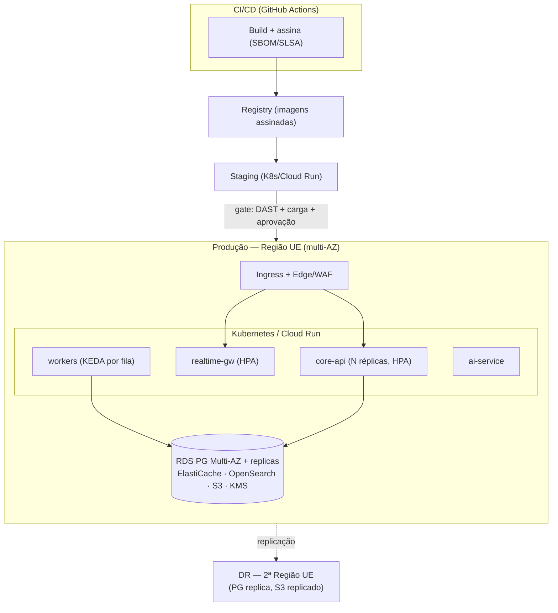
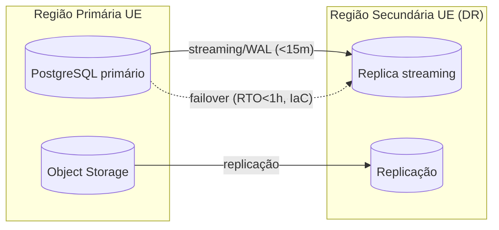

# 10 · Deployment Architecture

*(CTO + Principal Solution Architect)*

## Ambientes
| Ambiente | Propósito | Dados |
|---|---|---|
| **dev** | Desenvolvimento | Sintéticos (nunca reais) |
| **staging** | Pré-produção, DAST, testes de carga | Sintéticos/anonimizados |
| **prod** | Produção UE | Reais (encriptados) |
| **dr** | Disaster recovery (2ª região UE) | Réplica/backups |

Isolamento total entre ambientes (contas/projetos cloud separados; sem rota de dados reais para dev/staging).

## Deployment diagram

## Estratégia de release
- **Trunk-based** + feature flags; **release train** quinzenal; **hotfix** acelerado para segurança.
- **Rolling / Blue-Green** para serviços backend; **Canary** para mudanças de risco (% de tráfego).
- **Mobile**: TestFlight / Play staged rollout (5%→100%); **forced minimum version** (kill-switch de versões inseguras) via remote config.
- **Migrations** de DB versionadas, *backwards-compatible* (expand/contract), executadas com gates.
- **Rollback** automatizado por health/SLO; artefactos imutáveis e assinados.

## Multi-região / DR (RPO<15m, RTO<1h)

- **RPO<15m**: replicação streaming + WAL archiving frequente; replicação de storage.
- **RTO<1h**: IaC (Terraform) recria stack; promoção de réplica; runbooks ensaiados (**GameDays**).
- Backups **imutáveis (object lock)**, GFS (diário/semanal/mensal), **restore drills** regulares.

## Configuração & segredos
- **IaC (Terraform)** para tudo; **policy as code (OPA)**; *drift detection*.
- **Secrets Manager/Vault** + **KMS**; rotação; **OIDC** do CI para a cloud (sem credenciais long-lived).
- Config por ambiente via parameter store; **sem segredos em imagens/repos**.

## Observabilidade em produção
- **OpenTelemetry** (traces/metrics/logs) → Grafana/Prometheus + **Sentry**; **SIEM** para segurança.
- **SLOs** + error budgets; alertas on-call (PagerDuty); dashboards de negócio/segurança/custo.

## Justificação
- **Kubernetes gerido (EKS)** para escala e portabilidade; **começar com Cloud Run/Fargate** para menor overhead operacional no MVP.
- **KEDA** escala workers por profundidade de fila (faturação/notificações/scan) — eficiente em custo.
- **Multi-AZ desde o início + DR multi-região**: resiliência sem complexidade de active-active prematura.
