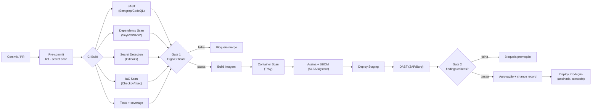
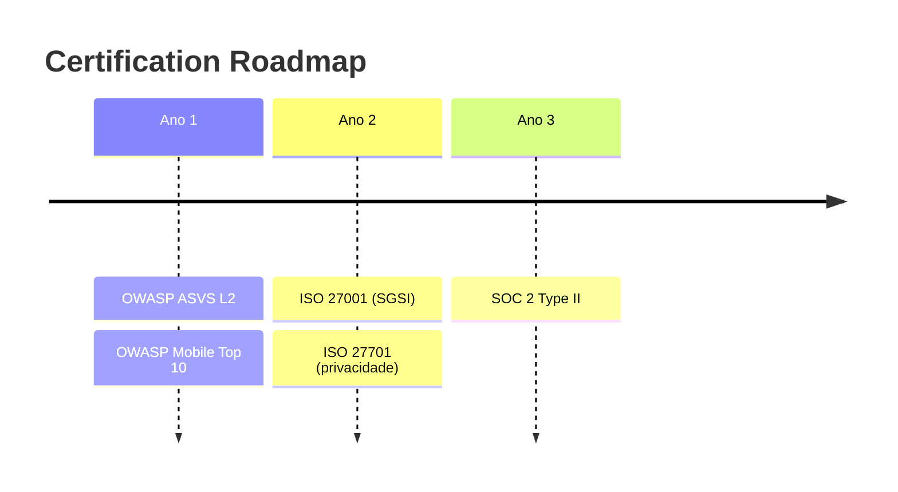

# 11 · DevSecOps Architecture

*(Cybersecurity Architect + CTO)*

Pipeline que **bloqueia deploys inseguros** (security gates obrigatórios). Detalhe das ferramentas em [E09 enterprise](../enterprise/09-devsecops-pentest-certs.md).

## Pipeline diagram

## Gates obrigatórios (bloqueiam o deploy)
| Etapa | Gate | Bloqueia se |
|---|---|---|
| Secret Detection | merge | Segredo detetado |
| SAST | merge | Vulnerabilidade High/Critical |
| Dependency Scan (SCA) | merge | CVE crítico sem mitigação |
| IaC Scan | merge | Misconfiguração de infra |
| Container Scan | build | Imagem vulnerável |
| DAST | promoção | Finding crítico em runtime |
| Assinatura/SBOM | deploy | Artefacto não assinado/sem proveniência |

## Princípios DevSecOps
- **Shift-left**: segurança no início (pre-commit/PR), não no fim.
- **Supply chain**: **SBOM** por release + **SLSA/sigstore** (proveniência) + verificação de assinatura na admissão (admission controller).
- **Least privilege no CI**: **OIDC** federado para a cloud (sem chaves long-lived); permissões mínimas por job.
- **Policy as code (OPA/Conftest)**: guardrails de infra e Kubernetes (sem privileged, read-only FS, network policies).
- **Immutable infra**: imagens versionadas/assinadas; sem alterações manuais em produção.
- **Ambientes efémeros de PR** para review com isolamento.
- **Branch protection** + revisão obrigatória + checks verdes.

## Gestão de vulnerabilidades & remediação
- SLAs por severidade (ex.: Crítico ≤ 24–72h, Alto ≤ 7d).
- Dependabot/renovate para patches; janelas de patching automatizado de base images.
- Inventário (SBOM) permite resposta rápida a zero-days (ex.: localizar lib afetada em minutos).

## Testes de segurança contínuos
- **Pentest** independente **pré-go-live** + **semestral** + após mudanças major.
- **Red-teaming** (incl. engenharia social e prompt injection da IA — [doc 06](06-ai-architecture.md)).
- **Bug bounty** (responsible disclosure) numa fase posterior.

## Roadmap de certificações (suporta o pipeline)
- **Ano 1**: OWASP **ASVS** (L2) + **Mobile Top 10** — evidência gerada pelo pipeline.
- **Ano 2**: **ISO 27001** (SGSI).
- **Ano 3**: **SOC 2 Type II**.
- **Trust center / data room** alimentado por artefactos do pipeline (relatórios, SBOM, evidências de controlos) → acelera due diligence ([E11](../enterprise/11-investment-readiness.md)).

