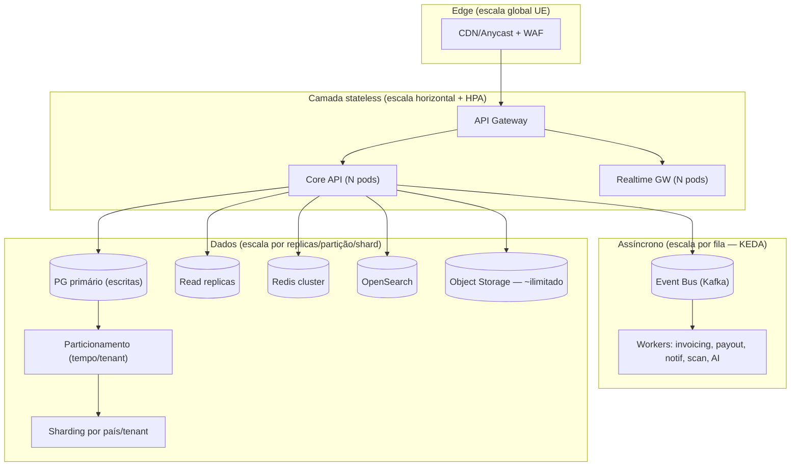
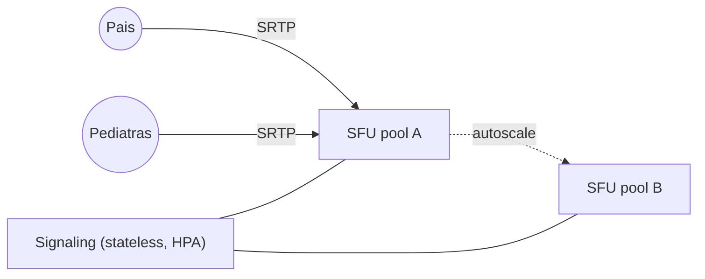

# 12 · Scalability Architecture

*(Principal Solution Architect + CTO)*

Desenhada para os alvos enterprise **sem redesenho estrutural** (ver [E10 enterprise](../enterprise/10-scalability.md)).

| Dimensão | Alvo |
|---|---|
| Famílias | 1.000.000 |
| Pediatras | 10.000 |
| Documentos clínicos | 100.000.000 |
| Consultas/dia | 50.000 (picos 5–10×) |
| Vídeos simultâneos | 10.000 |

## Estratégia de escala (visão)

## Como cada alvo é atingido

### 50.000 consultas/dia (+ picos)
- Média ~0,6 req/s de criação; picos absorvidos por **stateless + HPA** e **filas** (trabalho pesado assíncrono).
- **Cache** (CDN→Redis) para marketplace e leituras; **CQRS** (leituras em OpenSearch).

### 1M famílias / 10k pediatras
- **Read replicas** + **connection pooling** (PgBouncer) para leitura.
- **Particionamento** de tabelas grandes; **sharding por país/tenant** quando uma instância saturar (chave já no modelo).

### 100M documentos clínicos
- Metadados em **Postgres particionado**; **binários em object storage** (escala ~ilimitada) com **lifecycle/tiering** (frio para antigos).
- Entrega via **CDN + signed URLs**.

### 10.000 vídeos simultâneos
- Chamadas tipicamente **1:1** (médico–família) → carga previsível (~20k streams).
- **SFU autoscaling** por região UE; sinalização stateless separada da media; **sem gravação por defeito** (poupa custo/storage).

## Chat em tempo real (escala de conexões)
- **Realtime Gateway stateless** + **Redis pub/sub** (ou NATS) para fan-out/presença; persistência assíncrona; escala horizontal de gateways.

## Padrões de resiliência sob escala
- **Backpressure/throttling**, **bulkheads** por integração, **circuit breakers**, **DLQ**.
- **Rate limiting** multi-dimensional (IP/conta/endpoint/método de pagamento).
- **Idempotência** em escritas críticas.

## Multi-país / multi-moeda / multi-idioma (escala geográfica)
- `Country`/`TaxRule`/`CommissionRule`/`currency` no modelo; **data residency por região**; estratégias fiscais/legais **plugáveis**.
- Onboarding de país = **configuração + integrações locais**, não reescrita.

## Validação contínua da escala
- **Load testing** (k6/Locust) contra os alvos e picos.
- **Chaos engineering** (falha de AZ/serviço) — valida RPO/RTO e resiliência.
- **Capacity planning** + observabilidade de saturação (tracing) para antecipar bottlenecks.
- **SLOs**: ex. API p95 < 300 ms; erro < 0,1%.

## Roadmap pragmático (não sobre-engenharia no MVP)
| Fase | Arquitetura | Escala |
|---|---|---|
| MVP | Monólito modular + PG + S3 + 1 região (multi-AZ) + Cloud Run | Milhares de famílias |
| Crescimento | Read replicas, particionamento, filas/KEDA, CDN, EKS | Centenas de milhares |
| Escala UE | Serviços extraídos, sharding por país, multi-região, SFU pools | Milhões / alvos enterprise |

> Princípio orientador: **chaves de sharding, multi-tenant, async-first e data residency presentes desde o dia 1** → a escala é evolutiva, sem redesenho.
