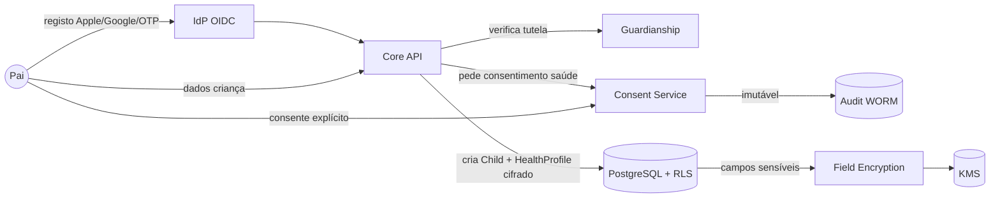
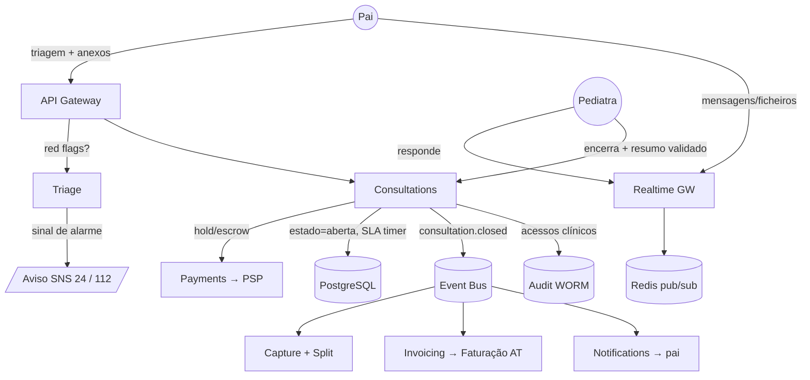
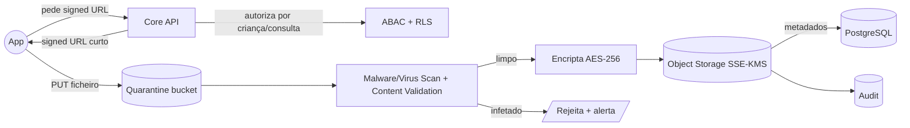
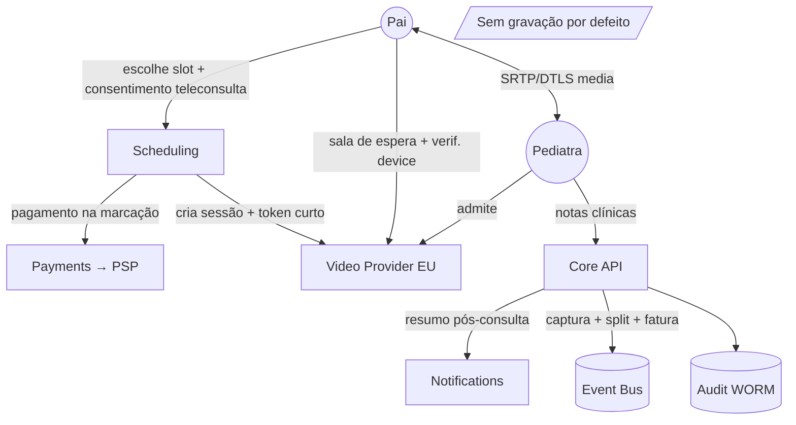
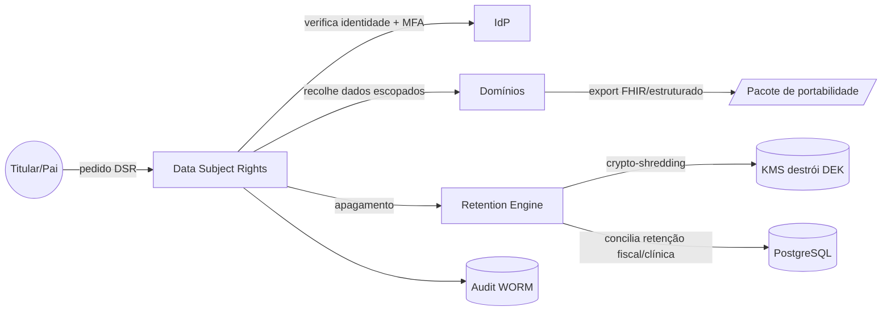
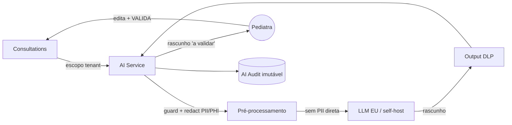

# 14 · Data Flow Diagrams (DFDs)

*(Principal Solution Architect)*

Fluxos de dados ponta-a-ponta dos cenários críticos. Complementam os DFDs de pagamento no [doc 07](07-payments-architecture.md).

## DFD-1 · Onboarding de pai + criança (com consentimento)

## DFD-2 · Consulta por mensagem (início → resposta → fecho)

## DFD-3 · Upload de ficheiro clínico (scan antes de armazenar)

## DFD-4 · Videochamada (agendamento → sessão → pós-consulta)

## DFD-5 · Direitos RGPD (acesso / apagamento / portabilidade)

## DFD-6 · Resumo por IA (human-in-the-loop)

## Classificação de dados nos fluxos
| Fluxo | Dado mais sensível | Proteção dominante |
|---|---|---|
| DFD-1 | Perfil de saúde da criança | Consentimento + field encryption + RLS |
| DFD-2 | Mensagens/anexos clínicos | Escrow pagamento + audit + encriptação |
| DFD-3 | Ficheiros clínicos | Scan + AES-256 + signed URLs |
| DFD-4 | Media de vídeo | SRTP + sem gravação + EU |
| DFD-5 | Conjunto de dados do titular | MFA + crypto-shred + conciliação legal |
| DFD-6 | Conteúdo clínico → LLM | Redação PII/PHI + EU boundary + DLP + audit |

> Todos os fluxos atravessam as camadas de Defense in Depth ([doc 09](09-security-architecture.md)) e registam acessos clínicos em **audit append-only**.
