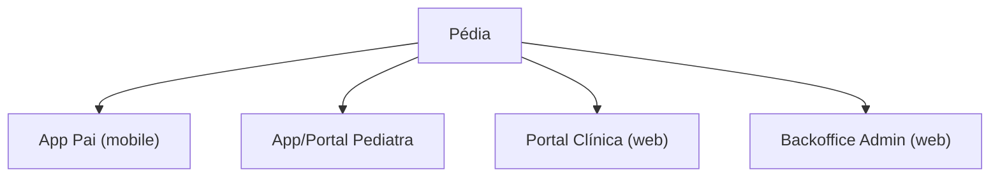

# 01 · Information Architecture

Quatro produtos numa plataforma, cada um com IA própria mas vocabulário e componentes partilhados.

## Mapa global



## IA — Pai (mobile, 5 secções de topo)

```
Início (Home)
├─ Crianças
│  ├─ Perfil da criança
│  │  ├─ Resumo de saúde (alergias, medicação, doenças, médico habitual)
│  │  ├─ Vacinas (PNV)
│  │  ├─ Crescimento (peso/altura/percentis)
│  │  ├─ Ficheiros (análises, relatórios, imagens, vídeos)
│  │  └─ Episódios clínicos
│  └─ Adicionar criança (+ consentimento)
├─ Consultas
│  ├─ Ativas (aberta / em triagem / respondida)
│  ├─ Conversa (chat / episódio)
│  ├─ Histórico (encerradas / arquivadas)
│  └─ Resumos & receitas
├─ Pediatras (Marketplace)
│  ├─ Procurar / Filtros
│  ├─ Perfil do pediatra
│  ├─ Favoritos ⭐
│  └─ Iniciar consulta → Triagem → Pagamento
├─ Agenda (videochamadas)
│  ├─ Marcar
│  ├─ Próximas
│  └─ Sala de espera / Chamada
└─ Conta
   ├─ Perfil familiar
   ├─ Faturas & pagamentos
   ├─ Subscrição
   ├─ Notificações
   ├─ Privacidade & dados (RGPD: aceder/exportar/eliminar)
   └─ Ajuda & segurança (SNS 24)
```

## IA — Pediatra (mobile + portal)

```
Consultas (Inbox)
├─ A responder (ordenado por SLA)
├─ Detalhe da consulta (vista clínica + resumo IA)
├─ Encerradas
Agenda
├─ Disponibilidade (horários, buffers, indisponível)
├─ Próximas videochamadas
Serviços & Preços
├─ Tipos de consulta, preço, SLA, âmbito
Finanças
├─ Receita, comissões, líquido
├─ Payouts, faturas, SAF-T
Perfil público
├─ Bio, idiomas, especialidades, cédula (verificada), avaliações
Conta
├─ Verificação/KYC, MFA, notificações, ajuda
```

## IA — Clínica (web)

```
Dashboard
Equipa
├─ Pediatras (convidar, gerir, permissões)
├─ Staff (rececionistas, gestores)
Operação
├─ Consultas da clínica
├─ Agenda agregada
Finanças
├─ Faturação centralizada, comissões, relatórios
Definições
├─ Dados da clínica, marca, papéis, integrações
```

## IA — Administrador (backoffice web)

```
Visão geral (KPIs)
Utilizadores (pais, pediatras, clínicas, staff)
Validação de pediatras (fila KYC/cédula)
Pagamentos
├─ Transações, reembolsos, disputas, payouts
Configuração
├─ Comissões (por país/pediatra/tipo/plano)
├─ Planos & subscrições, destaque marketplace
Relatórios (GMV, conversão, retenção, SLA, CSAT)
Moderação & Auditoria
├─ Avaliações, conteúdos, audit log
Compliance
├─ Pedidos RGPD, consentimentos, retenção, DPIA
Suporte
├─ Tickets, incidentes
```

## Modelo de conteúdo (entidades visíveis ao utilizador)
`Família` → `Criança` → (`Perfil de saúde`, `Vacinas`, `Crescimento`, `Ficheiros`, `Episódios`) · `Pediatra` → `Serviços` · `Consulta` → (`Mensagens`, `Resumo`, `Fatura`) · `Conta` → (`Pagamentos`, `Subscrição`, `Privacidade`).

## Princípios de IA
- **Profundidade ≤ 3 toques** para qualquer ação-chave (iniciar consulta, ver criança, marcar vídeo).
- **Criança como objeto central** — tudo se organiza à volta da criança e do episódio.
- **Marketplace e consulta** são o coração do produto do pai → atalhos persistentes.
- **Segurança clínica sempre acessível** (acesso a "Emergência?" a 1 toque em todo o lado).
