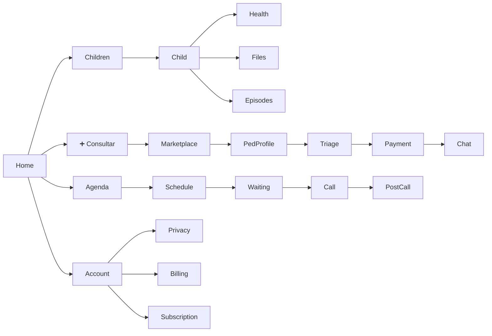

# 02 · Navigation Structure

## Padrão global
- **Pai / Pediatra (mobile)**: **bottom tab bar** (operável a uma mão; native em iOS e Android).
- **Clínica / Admin (web)**: **sidebar** lateral + topbar.
- **Modais e ações**: **sheets** ascendentes (iOS) / **bottom sheets** (Android) — mantêm o contexto e o polegar em baixo.

## Pai — Tab bar (5 separadores)

```
┌─────────────────────────────────────┐
│                                     │
│            (conteúdo)               │
│                                     │
├─────────────────────────────────────┤
│  🏠      👶      ➕      📅      ⊙   │
│ Início Crianças Consultar Agenda Conta│
└─────────────────────────────────────┘
```
- **➕ Consultar** é o separador central elevado (FAB-like) — ação mais valiosa (iniciar consulta), sempre ao alcance do polegar.
- Badges de estado (ex.: consulta respondida) nos separadores.

## Pediatra — Tab bar (4 separadores)

```
┌─────────────────────────────────────┐
│            (conteúdo)               │
├─────────────────────────────────────┤
│  📥       📅       €        ⊙       │
│ Consultas Agenda Finanças  Perfil   │
└─────────────────────────────────────┘
```
- Badge numérico em **Consultas** (a responder) e alerta de **SLA a expirar**.

## Clínica & Admin — Sidebar (web)

```
┌────────────┬────────────────────────┐
│  Pédia     │  Topbar: pesquisa · ⊙ │
│ ──────────  ├────────────────────────┤
│ ▸ Dashboard │                        │
│ ▸ Equipa    │      (conteúdo)        │
│ ▸ Operação  │                        │
│ ▸ Finanças  │                        │
│ ▸ Relatórios│                        │
│ ▸ Definições│                        │
└────────────┴────────────────────────┘
```

## Hierarquia de navegação (padrões)
| Padrão | Uso |
|---|---|
| **Tab bar** | Topo de cada produto mobile (destinos paralelos) |
| **Push (stack)** | Drill-down (criança → vacinas); swipe-back iOS / back gesture Android |
| **Sheet/Modal** | Tarefas focadas (triagem, pagamento, consentimento, marcar slot) |
| **Full-screen cover** | Videochamada, onboarding |
| **Segmented control** | Sub-vistas (Consultas: Ativas / Histórico) |
| **Search + filters** | Marketplace de pediatras |

## Navegação de uma mão (reachability)
- **CTAs primários ancorados em baixo** (acima da tab bar), nunca no topo.
- Títulos grandes no topo (informativos), **ações no fundo** (alcançáveis).
- Gestos: swipe-back, pull-to-refresh, swipe em listas (arquivar/favoritar).
- **Sem ações destrutivas no topo** fora do alcance — confirmar em sheet inferior.

## Estados de navegação globais
- **Banner de segurança** persistente discreto: "⚠️ Emergência? → SNS 24" acessível em todos os ecrãs clínicos (1 toque abre sheet com 808 24 24 24 / 112).
- **Deep links / push**: notificação de "pediatra respondeu" abre diretamente a conversa.
- **Estado offline**: banner não-bloqueante; ações enfileiradas (ex.: rascunho de mensagem).

## Mapa de fluxo de navegação (Pai)


