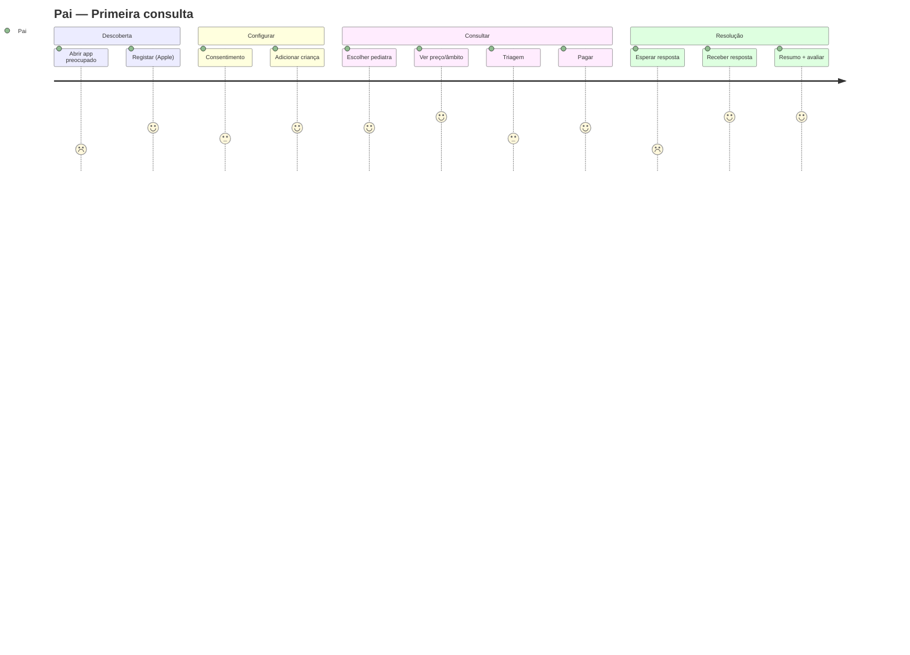

# 03 · User Journeys (orientadas a UX)

Jornadas com **estados emocionais**, fricções a remover e momentos de deleite. Complementam as [jornadas funcionais do blueprint](../docs/07-user-journeys.md).

## UJ-1 · Pai — Primeira consulta (jornada-âncora)

| Passo | Ecrã | Emoção | Decisão de design |
|---|---|---|---|
| Abre app preocupado | Welcome | 😟 Ansioso | Tom calmo; "Estamos aqui." 1 CTA |
| Regista | Auth | 😐 Impaciente | Apple/Google 1-toque; passkey; sem password |
| Aceita termos/consentimento | Consent | 🤔 Cauteloso | Linguagem simples, 🔒 visível, granular |
| Adiciona criança | Add child | 🙂 Investido | Form curto, progressivo; salva automático |
| Procura pediatra | Marketplace | 🧐 Avaliador | Badge ✅, rating, "responde ~4h", preço claro |
| Vê âmbito e preço | Start consultation | 😌 Aliviado | Transparência total **antes** de pagar |
| Triagem | Triage | 😟→😌 | Sinais de alarme com encaminhamento; tranquiliza |
| Paga | Payment | 😐 | MB WAY/Apple Pay 1-toque; "só cobrado se responder" |
| Espera | Chat (aberta) | 😟 | SLA visível, "a Dra. costuma responder em ~4h" |
| **Recebe resposta** | Chat (respondida) | 😄 **Aha!** | Push → abre conversa; resposta clara + receita |
| Fecha + avalia | Summary | 🥰 Confiante | Resumo descarregável; pedir avaliação |

**Métrica de UX**: time-to-first-question < 3 min; clareza de preço antes de pagar = 100%.

## UJ-2 · Pai — Gerir saúde da criança (retenção)
Adicionar vacina → ver percentil de crescimento → guardar análise → tudo num só sítio.
**Deleite**: gráfico de crescimento bonito e compreensível; lembrete proativo de vacina.

## UJ-3 · Pai — Videochamada
Escolher slot → consentimento → pagar → lembrete → sala de espera (teste câmara/micro) → chamada → resumo pós-consulta.
**Fricção removida**: verificação de dispositivo antes de entrar (evita pânico técnico no início).

## UJ-4 · Pediatra — Responder (eficiência)
Push de nova consulta → vê triagem + histórico + **rascunho de resumo IA** → responde → encerra com resumo validado.
**Deleite**: rascunho IA poupa tempo; tudo organizado por criança/episódio; SLA gerível (não 24/7).

## UJ-5 · Pediatra — Onboarding & verificação
Registo → upload cédula + identidade → estado "em validação" → aprovado → define serviços/preços → perfil público ativo.
**Confiança**: barra de progresso de verificação; clareza sobre o que falta.

## UJ-6 · Clínica — Onboarding de equipa
Criar clínica → convidar pediatras → atribuir papéis → faturação centralizada → ver relatórios.

## UJ-7 · Admin — Validar pediatra
Fila de validação → rever cédula/identidade → aprovar/pedir correções → log auditável.

## UJ-8 · Admin — Resolver disputa
Notificação → rever consulta (registo) → decidir reembolso → nota de crédito → comunicar.

## Mapa de jornada emocional (Pai, primeira consulta)

## Princípios transversais das jornadas
- **Reduzir ansiedade** em cada passo (microcopy tranquilizador, próximos passos óbvios).
- **Transparência antes de compromisso** (preço/âmbito/SLA antes de pagar).
- **Segurança clínica** sempre a 1 toque.
- **Momentos de deleite** funcionais (resposta rápida, gráficos claros, faturação invisível).
